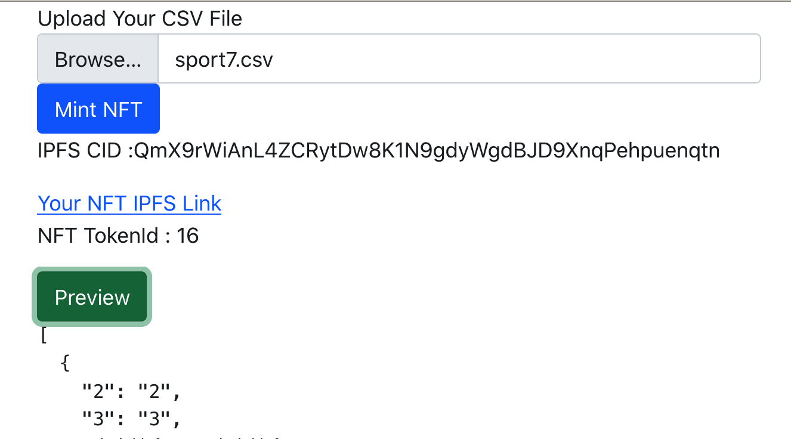

# CSV to NFT with Node.js and React.js

User can upload CSV file to mint NFT, and store in IPFS.

## Backend
- npm install
- npm start

create a public directory in backend root

## Front end
- npm install
- npm start

## Smart contract

npm install --save-dev hardhat
npx hardhat

deploy on rinkeby after develope smart contract 
=======
deploy on rinkeby test network after develope smart contract 

NFT contract address: 0xe6D825262E7549f38E8F64FCc9FAb4cDd3010Ab3

## Demo Result

 

## Use Docker containers to seperate Backend and Frontend

start docker daemon, eg. docker dashboard.

- docker network create nft_network

build image of backend

- cd backend
- docker build -t backend:lastest .

run container of backend
- docker run -d -p 5000:8000 --name mybackend --network nft_network --env-file .env  backend:lastest

build image of frontend

- cd frontend
- docker build -t frontend:lastest .

echo "REACT_APP_Server_URL=http://localhost:8000/" > ./frontend/.env.production

run container of frontend
- docker run -d -p 8085:3000 --name myfrontend --network nft_network --env-file .env frontend:lastest

<<<<<<< HEAD
docker run -d -p 8085:80 --name myfrontend --network nft_network --env-file .env react-nginx:lastest  

=======
>>>>>>> 6ea217e84eed1b23907233d0c0e977b620136f63
=======
>>>>>>> b9184bb7d3651cbe03ec32f851ca8c0cd6141f7a
